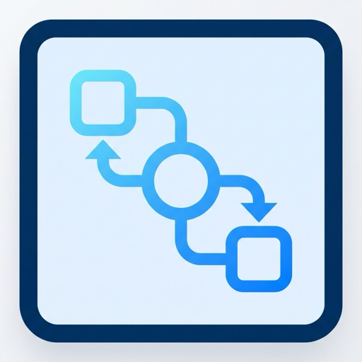
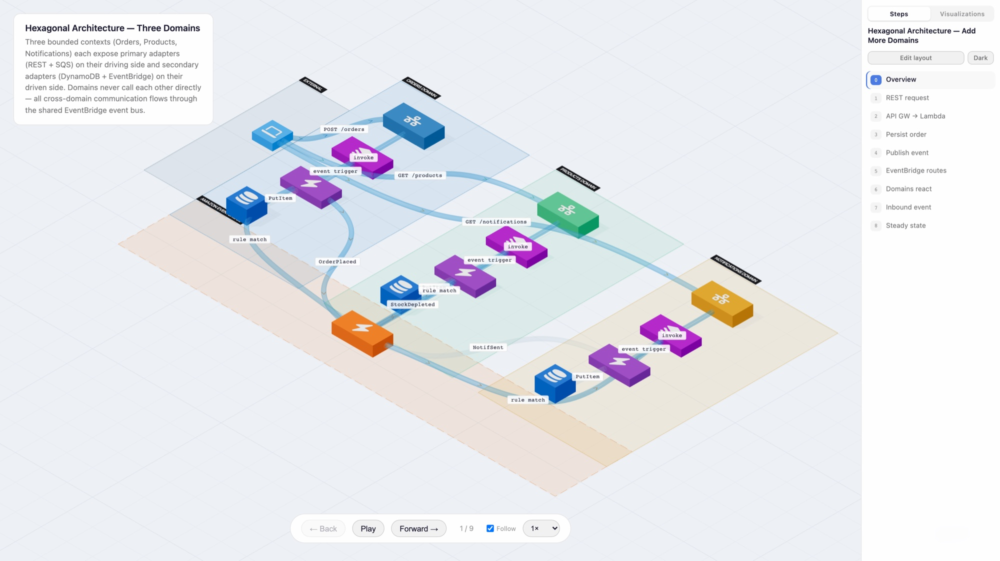
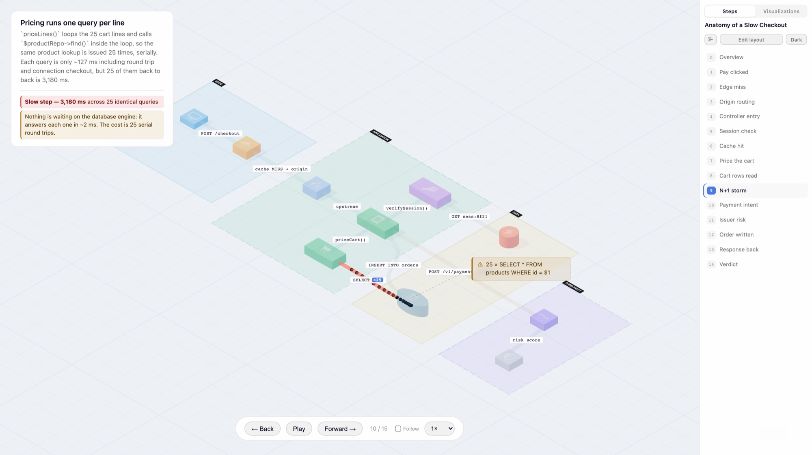
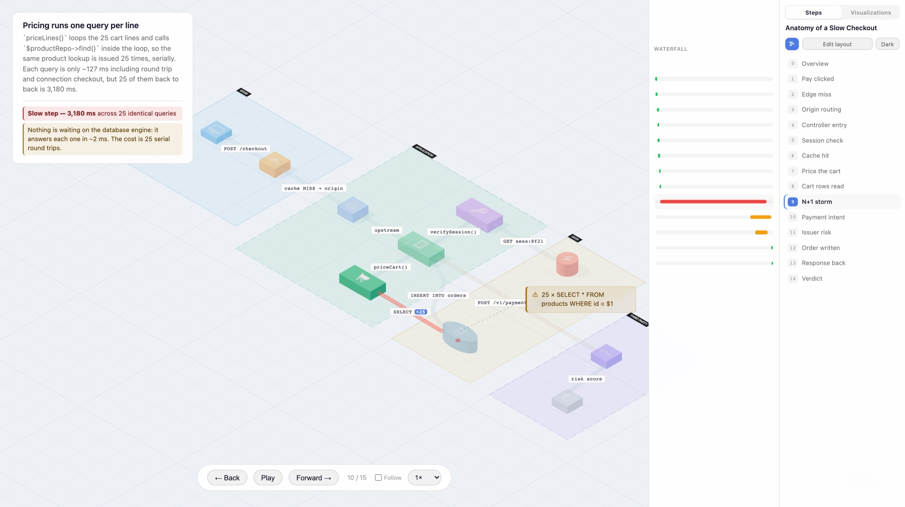
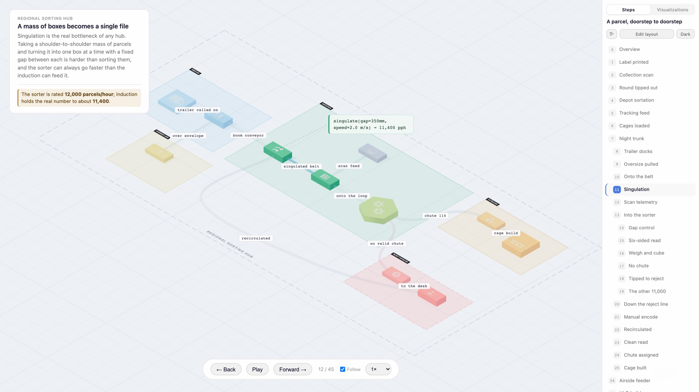
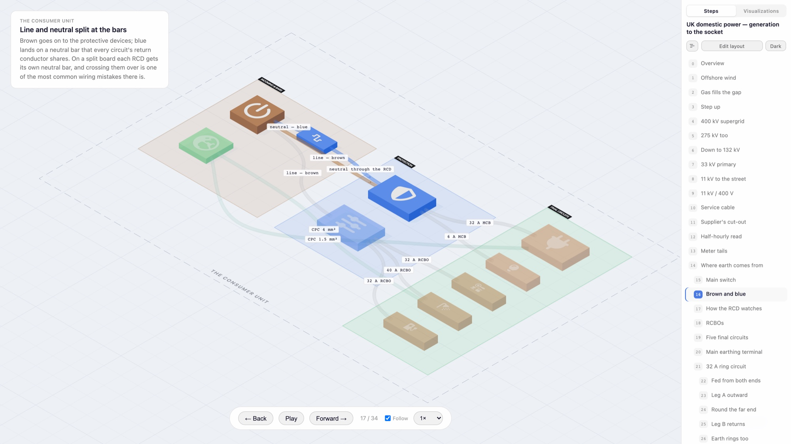
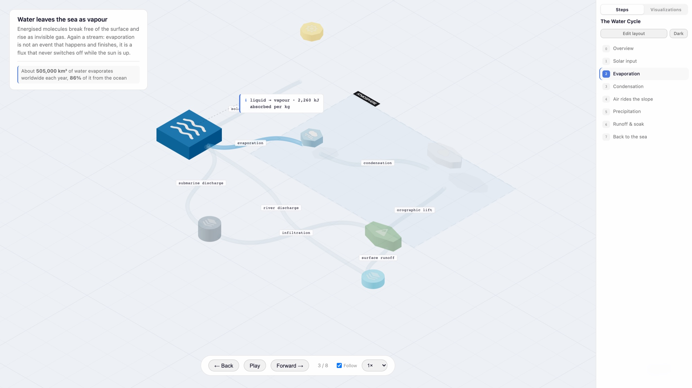
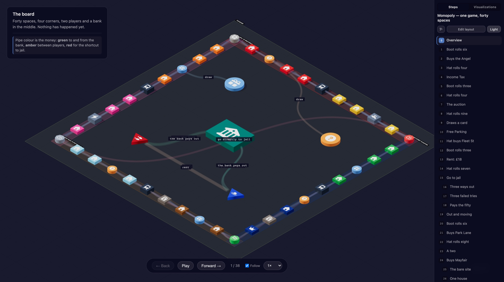
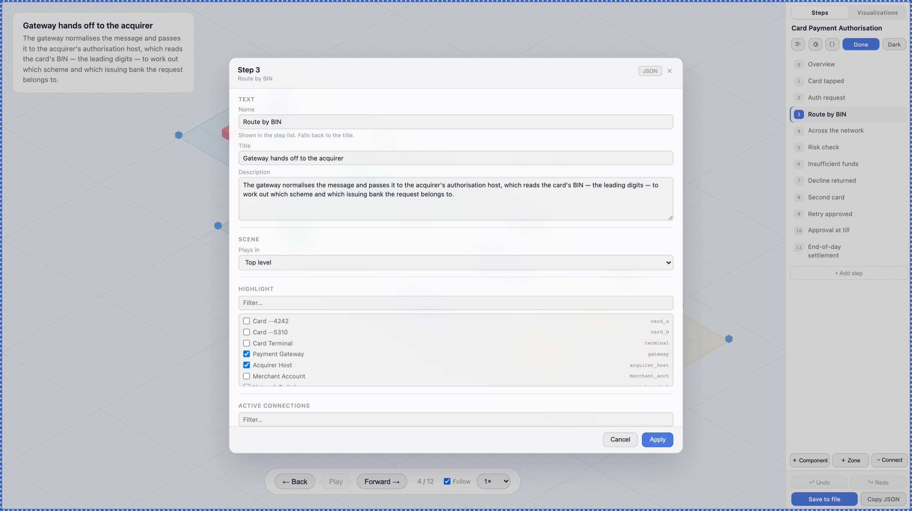

# FlowViz

An animated isometric 3D data-flow diagram tool. Describe a system architecture in a JSON file and step through an animated explanation of how data moves through it — complete with glowing glass tubes, flowing packets, nested sub-scenes, and annotation cards.

**FlowViz is designed to be driven by LLMs.** The authoring guide (`flow-authoring-guide.md`) is written as a structured reference that a language model can read once and immediately use to produce a valid, well-laid-out diagram JSON. Give an LLM the guide and a description of your system — AWS stack, microservices, event-driven pipeline, hexagonal architecture, etc. — and it will generate a ready-to-render flow in one pass.

## What it does

- Renders components (services, databases, clients, queues, serverless functions) as 3D meshes on an infinite isometric grid, in one of five extruded shapes with a Font Awesome icon or brand logo on top
- Connects them with glass tube pipes that illuminate when active
- Animates data packets travelling through the pipes, with optional arrival styles (success / error / warning) and repeat bursts for work that happens N times over
- Steps through a narrative sequence: each step can highlight components, activate connections, fire packets, show annotation callouts, and pin emphasised footer notes under its description
- Supports zone groupings (with optional nesting and dashed outlines) to visually bound logical boundaries like cloud regions or bounded contexts
- Chevron stream animation for genuine continuous data flows (Kafka, video, WebSockets)
- **Nested scenes:** a component can contain a scene of its own, to any depth. Steps inside it are rendered in that scene, with the camera diving in and pulling back out
- **Waterfall column:** give steps a measured bar and the sidebar slides out a waterfall showing where the time, rows, retries or cost went — the unit is yours, the renderer assumes nothing, and `meta.waterfallLabel` titles the column with whatever it is you measured
- **Edit mode:** place components and zones on the grid, draw connections, add / duplicate / delete steps, drag components, resize and move zones, edit routing waypoints, change a component's size / shape / colour / icon, set its pinned label and anchor, rename zone and pipe labels. Deletes show what they cascade to first, edits are undo/redo-able (⌘Z / ⇧⌘Z), and any object — or the whole flow — can be edited as raw JSON when no form covers what you need. **Save to file** writes it back to the flow's JSON (or Copy JSON to paste it elsewhere)
- **Pinned component labels:** a component can carry an always-visible name, anchored at any of nine points against it and tinted with its own colour, for when a diagram has to be read as a still rather than hovered. A playback-bar toggle turns them on
- **Export:** a PNG of the step — either the whole diagram on its own (step list, description box and controls left out, framed whole whatever the screen is showing) or the screen as it stands. Both render several times above screen resolution, so the labels stay legible at full size. Or a play-through as WebM (records the live animation, so packets actually travel) or GIF (one frame per step). The flow's own JSON downloads from the same menu, unsaved edits included
- **Viewer controls:** zoom in and out a step at a time (buttons or `+` / `-`), with a readout that says how far in you are and returns you to the opening framing when pressed; hide the pipes when the tubes crowd a screenshot; slide the step list off screen to give the diagram the whole window
- **Component cards:** hover a component for what it is, then pin its card open or light every connection it makes across the whole flow — the fan-in and fan-out a step-at-a-time reading never shows
- **Two views:** the isometric default, or a plan view looking straight down — a flat flowchart with square-on labels and no occlusion, for diagrams dense enough that reading beats depth. Shadows are dropped in plan view, and `?view=plan` opens straight into it
- **Present mode:** fullscreen, no chrome, keyboard-driven — `F` to enter, `Esc` to leave, arrows to step. Deep-link any step with `?step=<n>`
- **Layout lint:** the geometry rules in [`docs/flow-rules.md`](./docs/flow-rules.md), checked in edit mode and from the CLI — including pipes that sweep through a bystander the renderer will fade mid-flight
- **Tidy layout:** re-lays a scene left to right — layered by connection, rows banded by zone, zone bounds re-flowed around their members. Opt-in and one undo; best on a rough draft, since a hand-tuned layout will come back larger
- Light and dark themes

## Authoring flows with an LLM

Flows are plain JSON files under `public/flows/`, in one of two directories:

| Directory | What goes there |
|---|---|
| `public/flows/examples/` | Committed to the repo. The flows that ship as reference material — editable and savable, but the UI and the dev server both refuse to delete them. |
| `public/flows/custom/` | **Git-ignored.** Your own and your product's flows — they stay on your machine. |

New flows belong in `custom/` unless you specifically mean to add a shipped
example. Drop the `.json` file in, restart the dev server (the flow list is read
at startup) and it appears in the **Visualizations** tab of the sidebar.

Load one directly with `?flow=<file-name-without-json>` — the id is just the
filename, so `?flow=oauth` works wherever the file sits.

**[`flow-authoring-guide.md`](./flow-authoring-guide.md)** is the single reference an LLM needs. It covers the full JSON schema, layout rules, zone gap requirements, packet/stream usage, annotation types, nested scenes, waterfall bars, and the aggregation rules for turning a large trace into a readable number of steps — with enough examples that a model can produce a correct diagram without iteration. Attach it to a prompt like:

> "Read flow-authoring-guide.md, then create a FlowViz JSON for [your system description]."

**Example flows:**

These ship in `public/flows/examples/` and between them exercise every feature
the renderer has. Start with the coffee shop; it is deliberately the simplest
thing the tool can draw.

| File | Size | What it shows |
|------|------|---------------|
| `coffee-shop-order.json` | 6 / 6 | The ten-second read: components, icons, one packet per step |
| `water-cycle.json` | 7 / 8 | Streams vs packets, a reverse flow, a closed loop, `elevation` |
| `blood-circulation.json` | 8 / 11 | Not software at all — the double circuit, laid out as a body |
| `farm-to-shelf.json` | 8 / 6 | The smallest nested-scene example, three levels deep |
| `slow-checkout.json` | 10 / 15 | A trace: the waterfall, an N+1 burst, a coloured slow pipe |
| `card-payment.json` | 11 / 12 | A decline then a retry — error arrivals, brand logos, ms waterfall |
| `hexagonal-architecture.json` | 14 / 9 | Three bounded contexts with a shared EventBridge event bus |
| `airport-departure.json` | 20 / 18 | Two sub-scenes; passenger and suitcase reconverging |
| `uk-power.json` | 33 / 34 | Pipe colour carrying meaning: a voltage ramp, then real cable colours |
| `parcel-network.json` | 40 / 45 | The big one: four scenes three levels deep, 42 waterfall bars |
| `monopoly.json` | 58 / 38 | The London board, exactly — 40 spaces, a game played out, two sub-scenes |

*Size is components / steps, counting every nested scene.*

## Checking a flow without opening it

```bash
pnpm validate                              # every flow under public/flows
pnpm validate public/flows/custom/x.json   # just this one
pnpm validate --lint                       # …and check the layout too
pnpm validate --tidy public/flows/custom/x.json   # re-lay it and write it back
```

Runs the app's own schema and graph build against the file, so the errors are
the ones the browser would give you — every one at once, rather than the first.
Exits non-zero when anything fails, so it drops straight into a pre-commit hook
or CI.

`--lint` adds the geometry rules in
**[`docs/flow-rules.md`](./docs/flow-rules.md)** — overlapping components, pipes
sweeping through bystanders that the renderer will fade mid-flight, zone spacing,
wasted grid. Those findings are advisory and don't change the exit code unless
you add `--strict`; in the app they show as *layout notes* while editing, and
never block a save. The rules doc is generated from the linter (`pnpm rules`), so
it can't drift from what is actually checked.

## The Claude Code skill

`skills/flowviz/` is a Claude Code skill that authors flows **from any repo** —
it finds this checkout, reads its guide and schema, interviews you about intent
and depth, then writes and validates a flow into `public/flows/custom/`. Install
and packaging instructions are in [`skills/README.md`](./skills/README.md).

### Set up, once

```bash
pnpm install                                              # in this repo
unzip -o skills/dist/flowviz.skill -d ~/.claude/skills    # install the skill globally
echo 'export FLOWVIZ_DIR=$(pwd)' >> ~/.zshrc              # optional; only needed for >1 checkout
```

Restart Claude Code afterwards. The checkout path is also cached in
`~/.cache/flowviz/repo-path` — set it directly with
`bash ~/.claude/skills/flowviz/scripts/flowviz-locate.sh --set <path>`.

### Generating a flow from another repo

1. Start the dev server here: `pnpm run dev`.
2. In the other repo's Claude session, ask in plain words — *"make a flowviz of the webhook path in this repo"*.
3. Answer the four intake questions: audience and conclusion, start and end boundary, depth tier (sketch / walkthrough / forensic), and whether anything is measured.
4. It reads the real source there, writes `public/flows/custom/<slug>.json` here, and validates it against this checkout's schema.
5. Open `http://localhost:5175/?flow=<slug>`.

| Symptom | Cause |
|---|---|
| Flow missing from the Visualizations tab | The flow list is read at startup — restart the dev server |
| Nothing in `git status` | `custom/` is git-ignored by design |
| Skill doesn't trigger | It's scoped to flow diagrams; charts and dashboards belong to the built-in `dataviz` skill |
| Wrong checkout picked | Set `FLOWVIZ_DIR`, or cache the path with `flowviz-locate.sh --set` |

Aesthetic fixes are faster in the browser — **Edit layout**, drag, **Save to
file**. Ask Claude for structural changes instead, and save any browser edits
first so the two writes don't fight.

## Screenshots

### Overview — isometric grid, zones and glass tube pipes

Three bounded contexts, each in its own zone, joined by pipes that sit almost
invisible until a step lights them.



### Packets, repeat bursts and coloured pipes

One step of a trace: twenty-five identical queries down a pipe the author
coloured red, with the `×25` marker on its label and the diagnosis in the footer.



### The waterfall

Bars on a shared axis beside the step list. The weights are unitless — these are
milliseconds, but a flow can measure hours, kilometres or pounds instead.



### Nested scenes

A step tagged with a component's id plays *inside* it. A dashed boundary and the
scene's name are drawn on the ground, and the step list indents everything that
happens down there.



### Pipe colour that means something

Inside a house, the pipes are the real cable colours: brown line, blue neutral,
green earth. On the network outside, the same flow grades them by voltage.



### Streams

A chevron band for connections that stay open, as distinct from packets, which
are for things that arrive.



### Dark theme

The Monopoly board: forty spaces generated round the perimeter of a 21×21 grid,
because that is exactly what the real board is.



### Edit mode

Every field of every object is editable in place, including whole steps —
packets, streams, annotations, footer notes and the waterfall bar. Edits are
validated as you make them and written back to the flow's own JSON.




## Development

```bash
pnpm install
pnpm run dev      # http://localhost:5175
pnpm test         # vitest run
pnpm test:watch   # vitest
pnpm run build    # tsc -b && vite build
pnpm run lint
```

Both a `pnpm-lock.yaml` and a `package-lock.json` are committed; pnpm is the one
to use.

Notable changes are recorded in [`CHANGELOG.md`](./CHANGELOG.md), dated rather
than versioned. It starts at 2026-09-23 with a summary of what already existed;
everything earlier is in the commit history.

The port is pinned to **5175** in `vite.config.ts`. `coffee-shop-order` loads by
default; append `?flow=<name>` (any filename under `public/flows/`, without its extension)
to load a specific one.

Editing, saving and deleting flows all need the dev server — they write to
`public/flows/` through it, so none of them work in a static build. Saves are
validated against the flow schema before anything is written, so a save can't
leave a file the app won't load. Bundled examples can be saved (a bad save is one
`git checkout` away) but not deleted.

**Never stop the dev server with `pkill -f vite`** — that matches every vite process on the machine, including other repos' dev servers and `vitest`. Kill by port instead:

```bash
lsof -ti tcp:5175 | xargs kill
```
